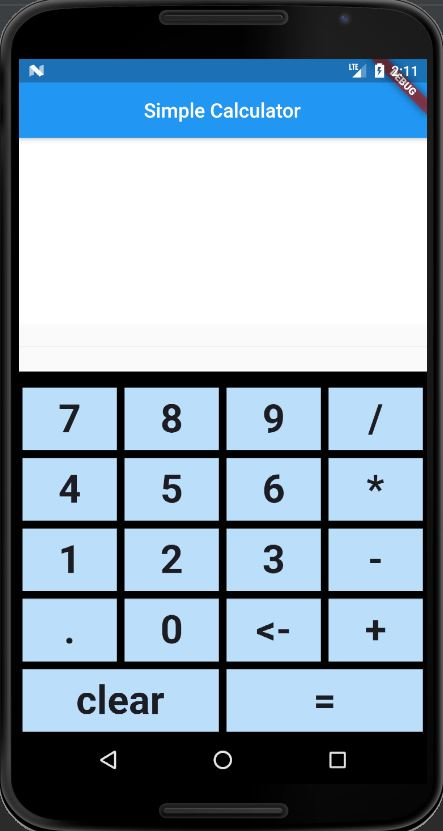
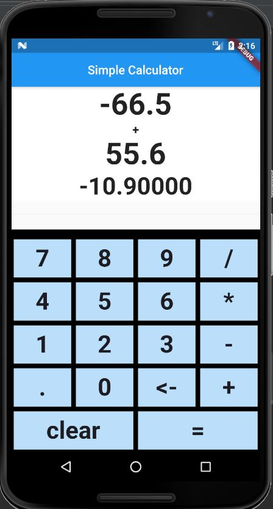

# Flutter Calculator

A simple calculator app using Flutter

# How to use this Repository 

1) Clone this repository to your device.
2) Create a new Project in your IDE (Android Studio/VS Code/ Whatever).
3) Copy the code of main.dart file of this repository to the main.dart file of your project.
4) That's it run the code and Party 🎉. 

😉
